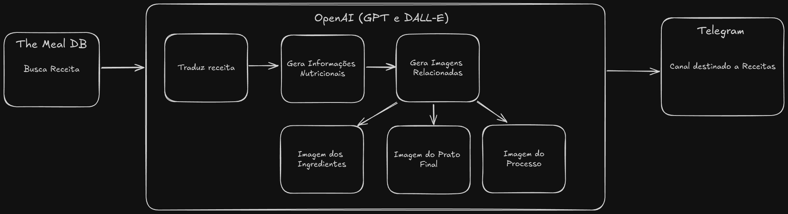

# 🍽️ Recipe Generator

This project leverages The Meal DB API to get random recipes, then translates them to Portuguese. It uses GPT for nutritional information and DALL-E for generating recipe images, all integrated through the Langchain framework.

All the information generated is sent to a Telegram Channel.

This project was created to PLN (Processamento de Linguagem Natural) class.

    

## 📂 Table of Contents

1. [🛠️ Setup Instructions](#-setup-instructions)
2. [🔄 How It Works](#-how-it-works)
3. [⚙️ Requirements](#-requirements)
5. [💡 Usage](#-usage)

## 🛠️ Setup Instructions

1. **Download Colab File**
   - Download the [colab file](./pln_project.ipynb)

2. **Open the Colab Notebook**
   - Open the provided Colab notebook file in Google Colab.

## 🔄 How It Works

1. **Fetch Recipes** 🍲
   - Retrieve random recipes using The Meal DB API.

2. **Translate Recipes** 🌐
   - Translate the fetched recipes into Portuguese.

3. **Generate Images** 🖼️
   - Use DALL-E to create images based on the recipes.

4. **Nutritional Information** 📊
   - Generate nutritional information with GPT.

5. **Integration** 🔗
   - Utilize the Langchain framework for seamless integration of all components.

6. **Telegram** 📱
   - Send all informations to a Telegram Channel

## ⚙️ Requirements

- Google Colab
- OpenAI API Token
- Telegram Bot Token
- Telegram Channel ID

## 💡 Usage

Just run every step from Colab File

Is expected in Telegram Channel messages like as the following example:

    

The following video show the project execution: https://youtu.be/HnOzImSo_IQ
